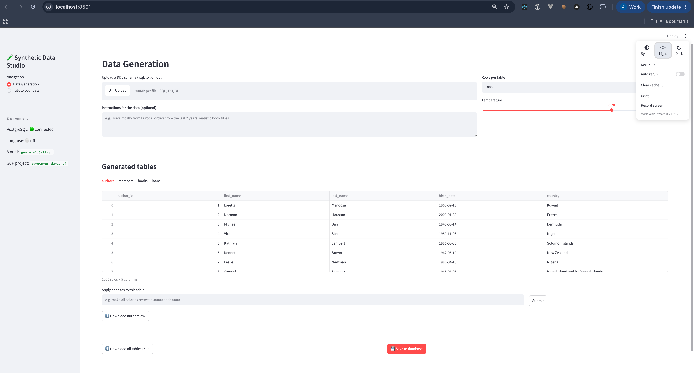
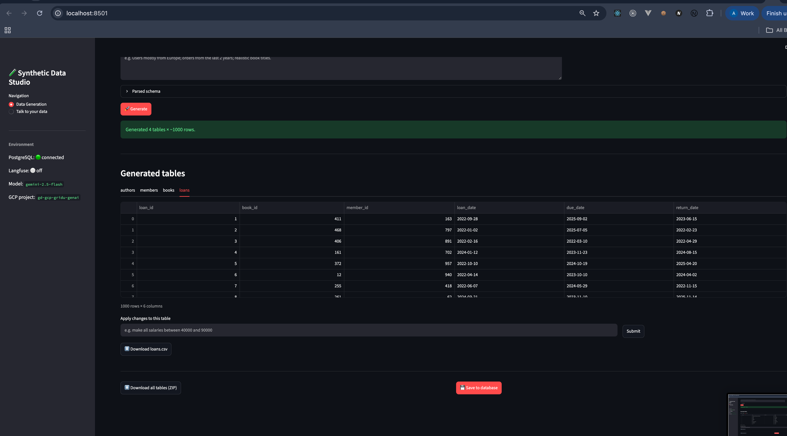
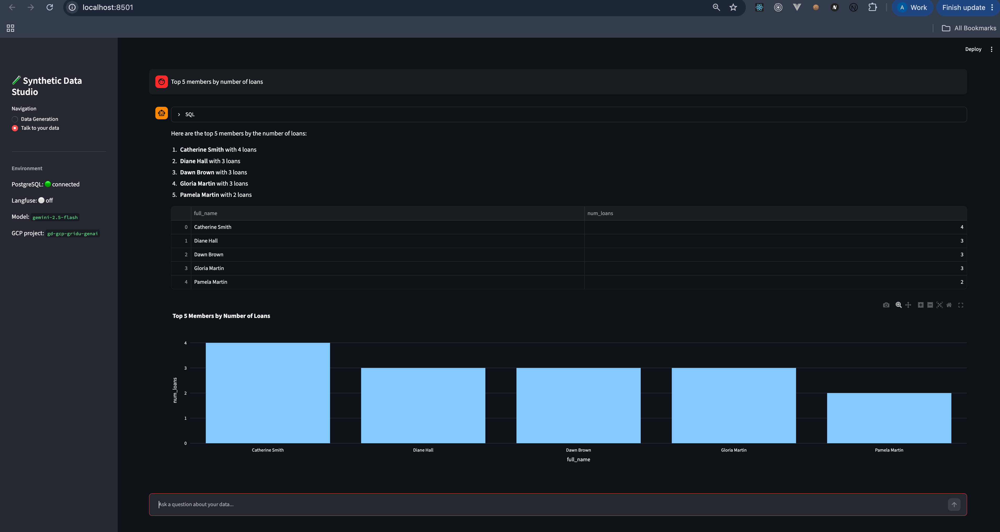
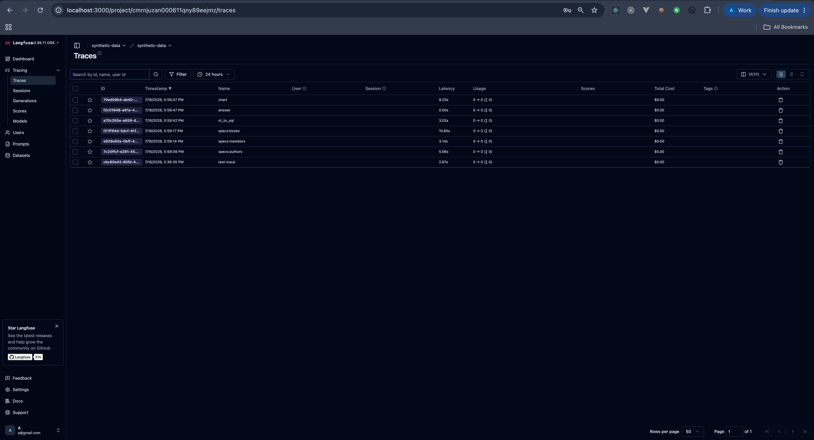

# Practice 1 — Synthetic Data Generation & Talk-to-your-data
### Project Report

**Author:** Anahit Gevorgyan (angevorgyan@griddynamics.com)
**Course:** GridU GenAI — Prompt Engineering (Novice)
**LLM:** Gemini 2.5 Flash via Vertex AI (Google GenAI SDK) — "Gemini 2.0 Flash or newer" as required

---

## 1. Objective

Build a conversational AI application with two capabilities:

1. **Synthetic data generation** — interpret a SQL DDL schema and generate
   realistic, constraint-valid synthetic data for it.
2. **Talk to your data** — let a user query the generated data in natural
   language and get answers as text, tables and plots.

The solution had to use Gemini (streaming, function calling, structured output),
the Google GenAI SDK with Vertex AI auth, a Streamlit UI, PostgreSQL, Docker and
Langfuse for observability.

---

## 2. Architecture & Tech Stack

| Layer | Technology |
|-------|------------|
| LLM | Gemini 2.5 Flash (Vertex AI, `google-genai` SDK) |
| UI | Streamlit |
| Database | PostgreSQL 16 (Docker) |
| Observability | Langfuse (Docker) |
| Data tooling | pandas, Faker, SQLAlchemy, sqlparse |
| Plotting | Plotly |

```
app.py                      Streamlit UI (Data Generation + Talk-to-your-data)
src/
├── config.py               environment configuration (.env)
├── llm.py                  Gemini (Vertex AI) client + Langfuse tracing
├── ddl_parser.py           DDL -> Schema (tables, columns, PK/FK, order)
├── db.py                   PostgreSQL access (SQLAlchemy + pandas)
├── data_generator.py       Phase 1: specs (structured output) + row synthesis
└── query_engine.py         Phase 2/3: NL->SQL (function calling) + stream + chart
docker-compose.yml          PostgreSQL + Langfuse
schemas/                    sample DDL schemas (library, restaurants, company)
```

---

## 3. Phase 1 — Synthetic Data Generation

### 3.1 DDL parsing
`ddl_parser.py` parses `CREATE TABLE` statements into a structured `Schema`
(tables → columns) capturing data type, nullability, primary keys, unique
constraints, serial columns and foreign keys. It also computes a **topological
generation order** so that parent tables are created before the children that
reference them.

### 3.2 Generation strategy (hybrid, LLM-guided)
Rather than asking the LLM to emit thousands of rows directly (slow, expensive,
error-prone), the generator uses a two-step hybrid approach:

1. **LLM produces a *generation spec* per column** using Gemini **structured /
   JSON output** (a Pydantic `ColumnSpec` schema). For each column the model
   chooses a strategy — a Faker method, a categorical set, a numeric/date range,
   a boolean probability, etc. — informed by the column semantics and the user's
   free-text instructions. This is where realism and instruction-following live.
2. **Rows are materialised in Python** from those specs. This guarantees:
   - **Primary keys** are unique sequences.
   - **Foreign keys** are sampled from the parent tables' *real* generated PK
     values → referential integrity holds even for 1000+ rows.
   - **UNIQUE** columns are de-duplicated; length/precision limits are respected.

This design cleanly satisfies the "configurable amount, e.g. 1000 rows/table"
requirement while keeping generation fast and constraint-safe.

### 3.3 Editing via feedback
Each generated table can be modified by typing a free-text instruction
(e.g. *"make all salaries between 40000 and 90000"*). `apply_feedback()`
re-derives the column specs for that table with the feedback folded into the
prompt and regenerates the rows, preserving PK/FK integrity.

### 3.4 Export & persistence
Generated tables can be downloaded per-table as CSV or all at once as a ZIP, and
saved into PostgreSQL (schema created from the DDL, data inserted in FK-safe
order) so they become available to the Talk-to-your-data tab.

---

## 4. Phases 2 & 3 — Talk to your data

The natural-language query pipeline (`query_engine.py`):

1. **NL → SQL via function calling.** The live DB schema is introspected and
   passed to Gemini, which is given an `execute_sql` tool declaration and calls
   it with a single read-only `SELECT` — demonstrating **function calling**.
2. **Execution.** The SQL runs against PostgreSQL and returns a DataFrame.
3. **Streaming answer.** Gemini writes a concise natural-language answer grounded
   in the result, **streamed** token-by-token into the Streamlit chat.
4. **Chart recommendation via structured output.** Gemini returns a `ChartSpec`
   (chart type + x/y columns) as JSON; the app renders it with Plotly (bar/line/
   pie/scatter) or shows nothing when a chart would not help.

So all three required Gemini techniques are used where they fit naturally:
**structured output** (specs + chart), **function calling** (NL→SQL),
**streaming** (answer text).

---

## 5. Observability (Langfuse)

Every Gemini generation is wrapped in a Langfuse trace (`llm.trace_generation`),
capturing the operation name, model, input, output and temperature. Langfuse runs
locally via Docker (http://localhost:3000). Tracing degrades gracefully to a
no-op when Langfuse keys are not configured, so the app always runs.

---

## 6. Results

- DDL parser correctly handles the three sample schemas (library, restaurants,
  company_employee), including inline and table-level FKs, and produces the
  correct FK-safe generation order.
- The app generates ~1000 rows/table with valid PK/FK relationships, previews
  each table, supports per-table feedback edits, and exports CSV/ZIP.
- The Talk-to-your-data tab answers natural-language questions with streamed
  text, a result table and an auto-selected Plotly chart.

### 6.1 Data Generation — generated tables preview
Uploading `library_mgmt.ddl` and clicking **Generate** produces ~1000 rows per
table. The `authors` table with realistic names, birth dates and countries:



The `loans` table shows that **foreign keys** (`book_id`, `member_id`) reference
valid parent rows — referential integrity is preserved:



### 6.2 Talk to your data — text + table + chart
Asking *"Top 5 members by number of loans"* returns a streamed natural-language
answer, the result table, and an auto-recommended bar chart:



### 6.3 Observability — Langfuse traces
Every Gemini call is traced in Langfuse: the per-table generation specs
(`specs:authors`, `specs:books`, `specs:members`), the NL→SQL step (`nl_to_sql`),
the streamed answer (`answer`) and the chart recommendation (`chart`), each with
latency and token usage:



---

## 7. Challenges

1. **DDL parsing edge cases.** Type extraction initially over-captured tokens
   (e.g. `DATE NOT` instead of `DATE`) and a leading file comment caused the
   first table to be skipped. Fixed by cutting the type at the first constraint
   keyword and stripping leading SQL comments before matching `CREATE TABLE`.
2. **FK integrity at scale.** Generating rows purely with the LLM cannot
   guarantee valid foreign keys. Solved with the hybrid approach: LLM decides
   *how* each column looks; Python enforces PK uniqueness and samples FKs from
   real parent keys in topological order.
3. **SDK/library & infra versions.** Langfuse 4.x changed its API, so it was
   pinned to 2.x to match the tracing code. The self-hosted Langfuse container
   also required a valid 64-hex-char `ENCRYPTION_KEY` (generated via
   `openssl rand -hex 32`) or it returned HTTP 500. Structured output required
   Pydantic models passed as `response_schema`.
4. **GCP access / IAM.** Vertex AI calls require the `roles/aiplatform.user` role
   on the project in addition to console access; a `403 IAM_PERMISSION_DENIED`
   on `aiplatform.endpoints.predict` had to be resolved by requesting the role
   from the project administrator.
5. **Model availability by region.** `gemini-2.0-flash` returned `404 NOT_FOUND`
   in the project/region; `gemini-2.5-flash` was available in `us-central1` and
   was used instead (the task allows "Gemini 2.0 Flash or newer").

---

## 8. How to run

See `README.md`. In short: `gcloud auth application-default login` →
`docker compose up -d` → `pip install -r requirements.txt` →
`streamlit run app.py`.
